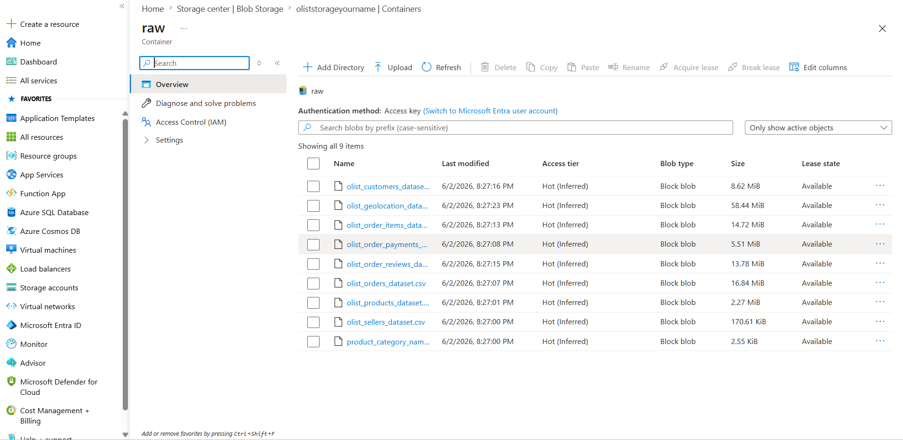
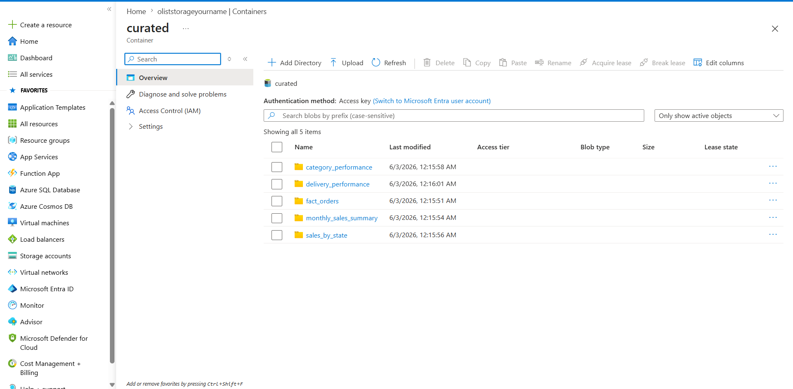
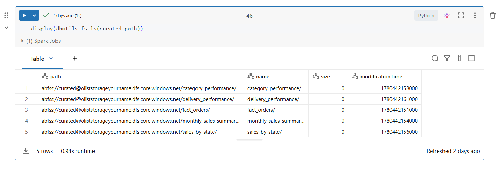
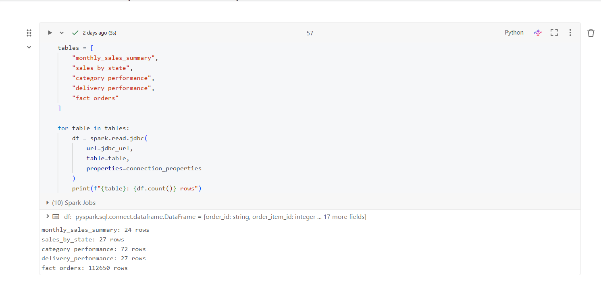
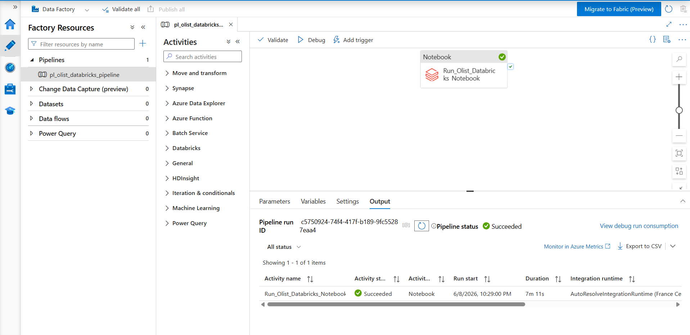

# End-to-End Azure E-Commerce Analytics Pipeline

## Project Overview

This project demonstrates an end-to-end cloud data engineering and analytics pipeline using Azure services. The pipeline processes the Brazilian Olist e-commerce dataset from raw CSV files into curated analytical tables and Power BI dashboards.

The goal of this project was to build a practical data pipeline covering data ingestion, transformation, orchestration, SQL loading, and business reporting.

## Architecture

Olist CSV Dataset  
→ Azure Data Lake Storage Gen2 Raw Container  
→ Azure Data Factory Pipeline  
→ Azure Databricks PySpark Transformation  
→ Azure Data Lake Storage Gen2 Curated Container  
→ Azure SQL Database  
→ Power BI Dashboard  

## Tools and Technologies

- Azure Data Lake Storage Gen2
- Azure Data Factory
- Azure Databricks
- PySpark
- Azure SQL Database
- Power BI
- DAX
- Parquet
- JDBC

## Dataset

The project uses the Brazilian Olist e-commerce dataset, which contains order, customer, seller, product, payment, and review data.

Main datasets used:

- Orders
- Order Items
- Customers
- Products
- Payments
- Reviews
- Sellers
- Product Category Translation

## Project Workflow

1. Uploaded raw Olist CSV files into Azure Data Lake Storage Gen2.
2. Created raw and curated storage containers.
3. Built a PySpark transformation notebook in Azure Databricks.
4. Cleaned and transformed order, customer, seller, product, payment, and review data.
5. Created a final fact table and business summary tables.
6. Saved curated outputs in Parquet format.
7. Loaded transformed tables into Azure SQL Database using JDBC.
8. Orchestrated the Databricks notebook using Azure Data Factory.
9. Connected Power BI to Azure SQL Database.
10. Built Power BI dashboard pages for sales, product, and delivery analysis.

## Final Tables Created

- fact_orders
- monthly_sales_summary
- sales_by_state
- category_performance
- delivery_performance

## Power BI Dashboard Pages

### Sales Overview

Includes KPIs and sales trends:

- Total Revenue
- Total Orders
- Average Order Value
- Total Freight
- Average Delivery Days
- Monthly Revenue
- Revenue by Customer State


### Product Analysis

Shows product category performance using revenue, orders, and average item value.


### Delivery Analysis

Shows average delivery days and order volume by customer state.


## Azure Pipeline Evidence

### Raw Data in ADLS Gen2



### Curated Outputs in ADLS Gen2



### Databricks Transformation



### Azure SQL Table Verification



### Azure Data Factory Pipeline Success



## Key Project Outcomes

- Built an end-to-end Azure data pipeline using real e-commerce data.
- Processed approximately 100K customer orders.
- Created curated Parquet outputs for analytics use.
- Loaded final tables into Azure SQL Database.
- Automated notebook execution using Azure Data Factory.
- Built Power BI dashboards for sales, product, and delivery insights.

## Repository Structure

```text
azure-olist-ecommerce-pipeline
│
├── docs
│   └── project_summary.md
│
├── notebooks
│   └── nb_olist_transformation.py
│
├── power bi
│   └── Power BI dashboard file
│
├── screenshots
│   └── Project screenshots and pipeline evidence
│
├── .gitignore
└── README.md
